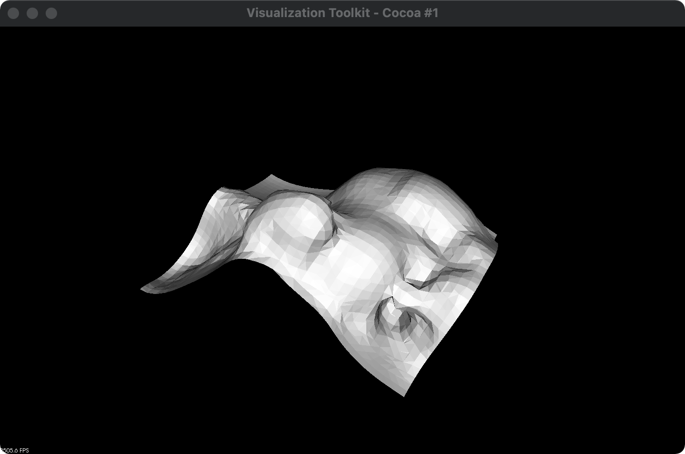
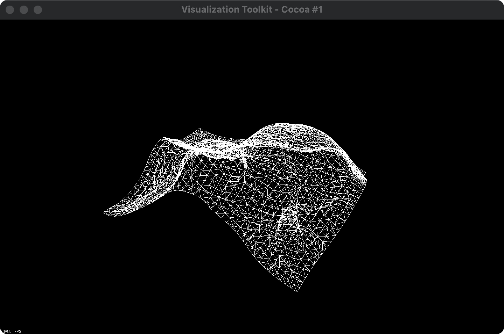

# 作业10报告

2021/1/16 余畅 电子科技大学

### 问题

任务(3选1)
+ 实现曲面重建的Crust算法
+ 实现RBF重建算法
+ 实现Poisson重建算法 (*)

### 实现

这两周都在考试周，苦逼本科生16号才考完最后一门，还没有仔细研究算法细节。目前先尝试成功配置了pcl库（https://pointclouds.org）并调用库内置的算法实现了Poisson Surface Reconstruction.

下阶段准备用Taichi实现 Poisson Surface Reconstruction 和 Simulation and Visualization of Ductile Fracture with the Material Point Method (https://dl.acm.org/doi/10.1145/3340259)，作为MPM simulation pipeline的最后一步。

## Coming soon... : )

by g1n0st

2021/1/16
