# 作业2报告

2020/10/24 余畅 电子科技大学

### 问题

使用RBF神经网络函数来拟合数据 ，仍限制在函数情形 ，与作业1的方法进行比较。

### 实现

本次作业因为使用 python 处理数据较为方便，所以采用 tensorflow1 + numpy 来完成。主要参考了助教提供的作业框架，在此基础上修改为优化给定组数的 Gauss 基函数的组合。并使用 python 重新实现了作业1中的`GuassInterpolation`，以便更加直观的进行比较。

在实现的神经网络模型中，共有5个超参数，和神经网络纯相关的超参数有：`training_epochs` 为训练迭代的次数，`learning_rate` 为学习率，在本次作业的讨论中将其设为0.01；为减少训练时长，使用`Adam`优化器进行优化。

其他参数有：`funcs_num` 指定了单层中神经元的个数，也即用于拟合的高斯基函数的个数；`w0_stragety`用于指定 $w_0$ 的选择策略，`average`为取待拟合点 $y$ 的均值，`minimum`为取 $y$ 的最小值，`zero`为取 $0$。

### 结果

#### 超参数的选取

+ `training_epochs`

  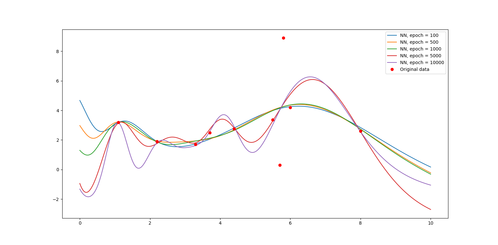

  `training_epochs`  值的大小对神经网络的拟合程度产生了极大的影响，在迭代次数较少的情况下，神经网络只能进行模糊的拟合，产生一个近似的结果，从结果可以看出大概只拟合出了数据中的低频信号；而在迭代次数增加以后，拟合函数逐渐逼近并收敛在各个采样点附近。

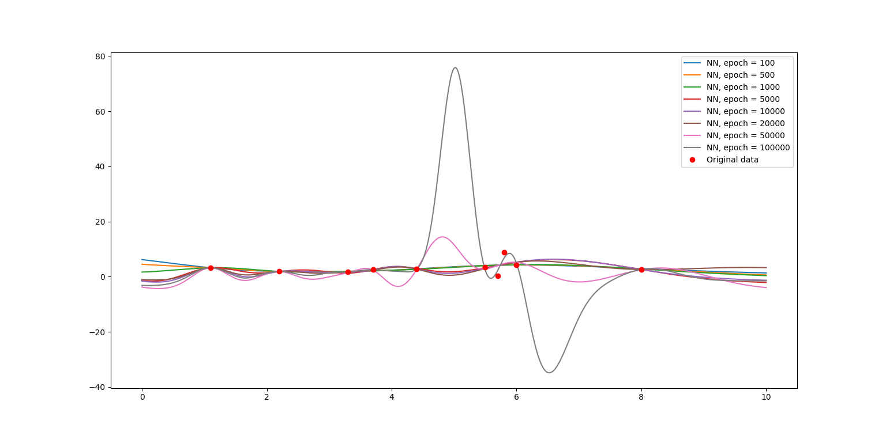

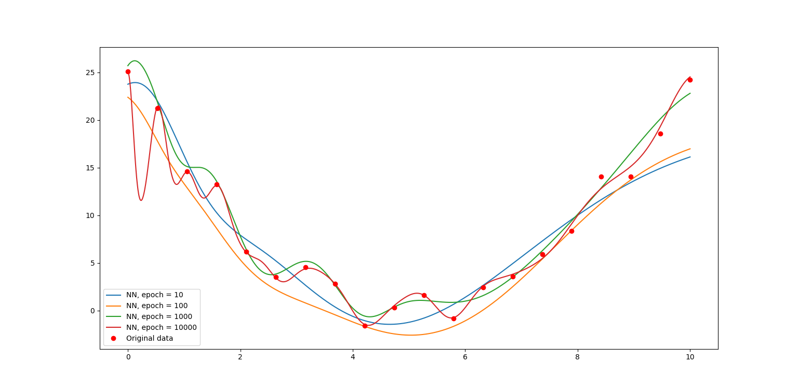

  但值得指出的是，在数据存在一定噪声的情况下，迭代次数并不是越高越好，如果将 $x = 6$ 附近几个波动较大的点看成高频噪声数据的话，越高的迭代次数反而产生了过拟合的结果（和 `funcs_num` 的值略大也存在一定关系，后文会进行分析）；以及上图中对二次函数数据加入一定的随机噪声，$10 ~ 100$ 次迭代反而是最好的结果。故可通过调整 `training_epochs`的值来改变拟合精度，或加入限制参数范围的正则项，并引入新的超参数。

+ `funcs_num`

  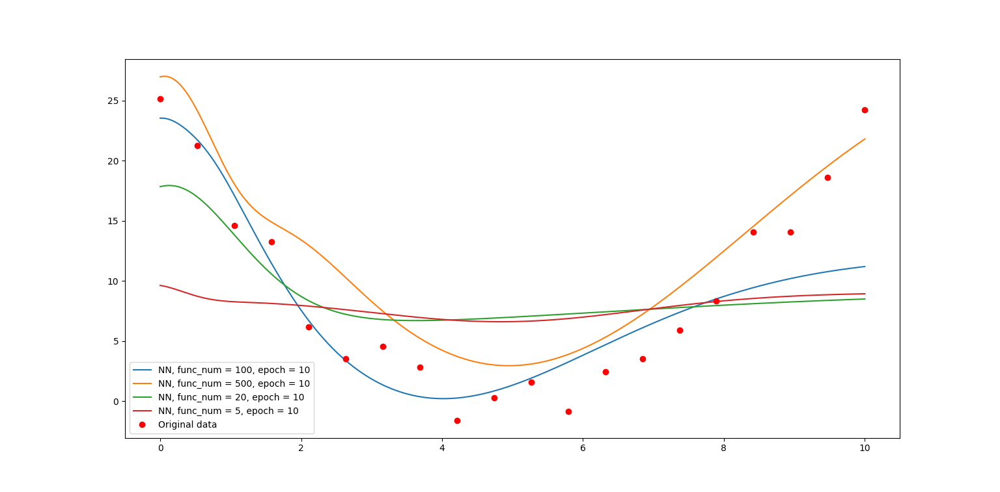

  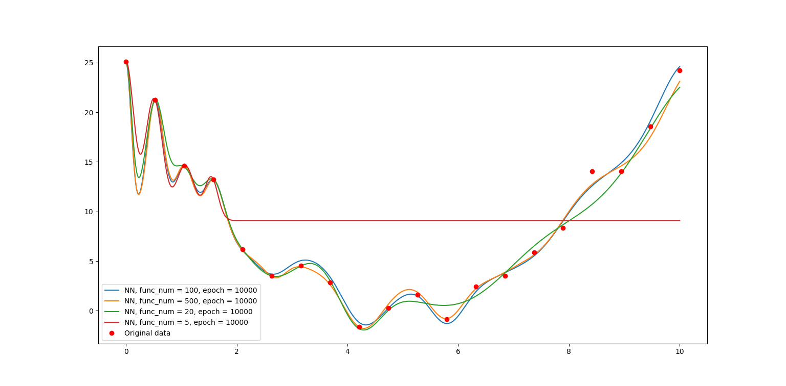

  显然，用于拟合的高斯基函数越多，即神经元的个数越多，神经网络的拟合性能也越好。同样一组二次函数+随机噪声的数据，在迭代次数较低的情况下，较低的神经元个数只能拟合出线性的结果，而较多的已经可以近似表达出二次的性质，在迭代次数增多的情况下，$5$ 个基函数显然低于数据点个数，为了完全拟合前几个数据点，在后半段区间中完全丧失了表达能力。同样值得注意的是，基函数的数量并不是越多越好，一方面会增加单次的训练时长，另一方面从上图可以看出，绿色曲线（即 `funcs_num` 取 $20$ 的表达较为平滑，而其他也有过拟合的趋势），下图的数据则更能说明问题。

  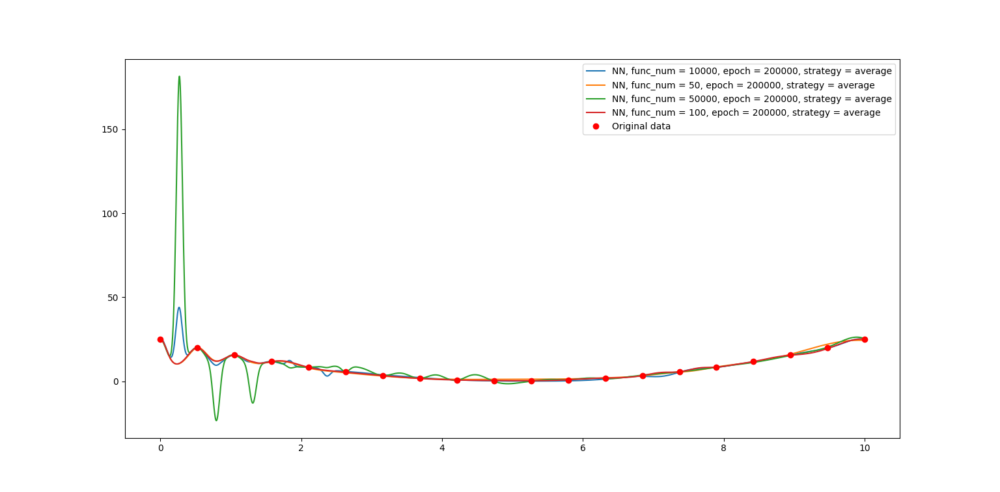

+ `w0_strategy`

  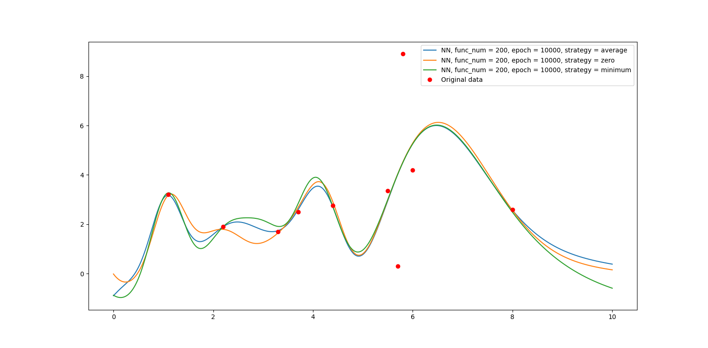

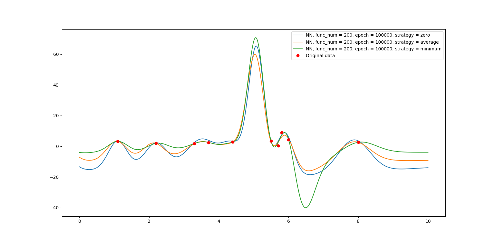

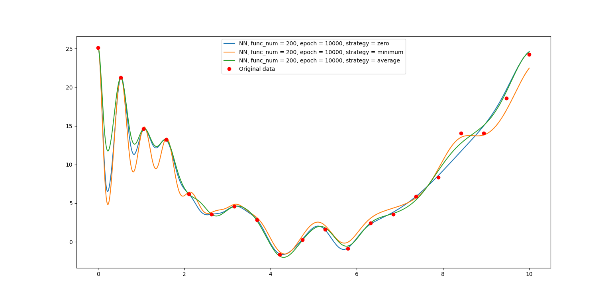

  `w0_stragety` 的选取不如前面两个参数明显，个人认为有一定原因是数据点的 $y$ 值差异不大，且和 $0$ 较为接近，相较之下选取均值（参考上次作业助教老师的意见）得到的曲线较为平滑，从下图无噪声的二次数据可以更明显的看出。

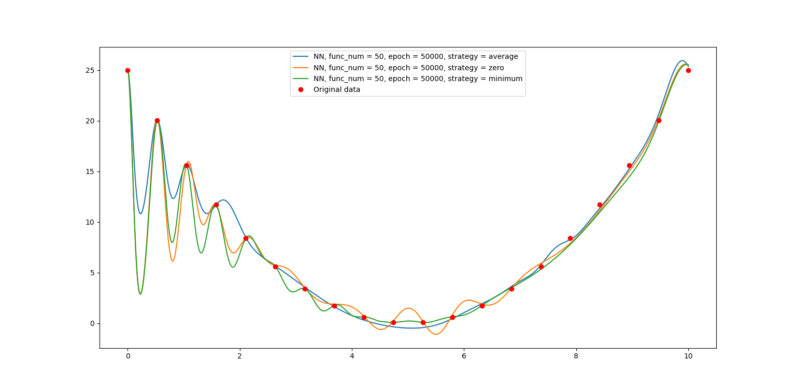

#### 和高斯函数插值比较

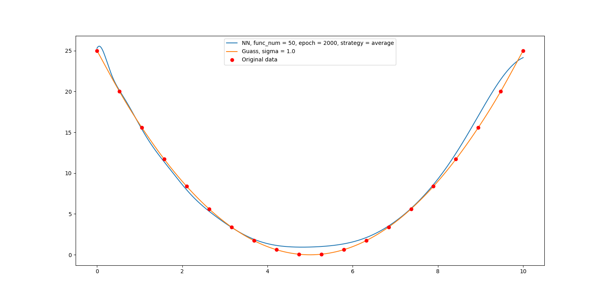

  对于间隔均匀、无噪声的数据，由于高斯函数插值统一了 $\sigma$，且在均匀间隔的位置上插值，而神经网络则是随机初始化神经元，故插值的结果优于拟合。

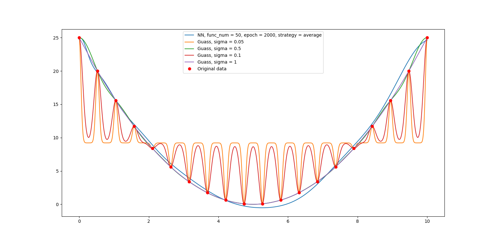

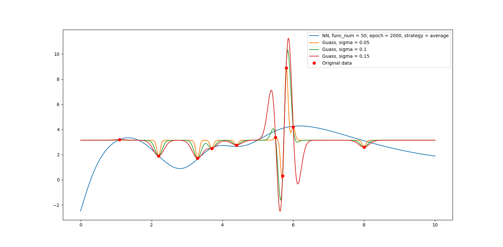

  但插值的 $\sigma$ 参数较为依赖于人工的选取，一方面在数据点分布为止的情况下，不好的参数几乎使得插值函数插值出错误的结果，另一方面如果数据点的分布不均匀，很难用一个统一的 $\sigma$ 参数去衡量整个插值区间，导致最后的函数往往出现过拟合的结果，而神经网络具有一定模糊的功能，可以得到一个近似、回归，但往往是更正确的结果。

g1n0st

2020/10/24