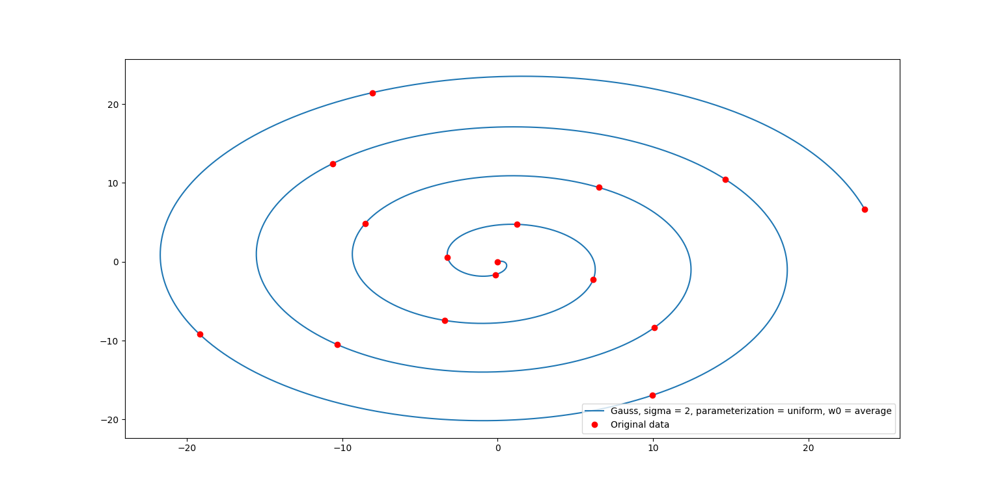
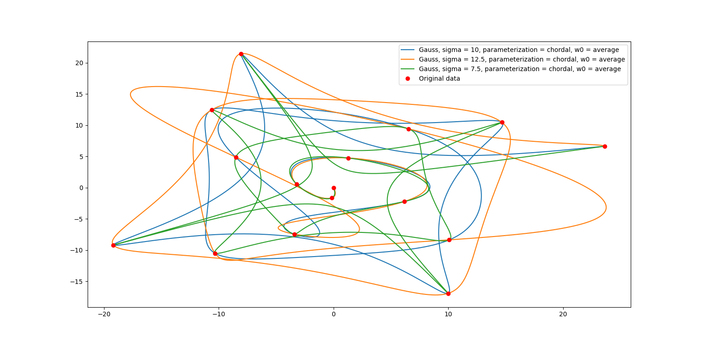
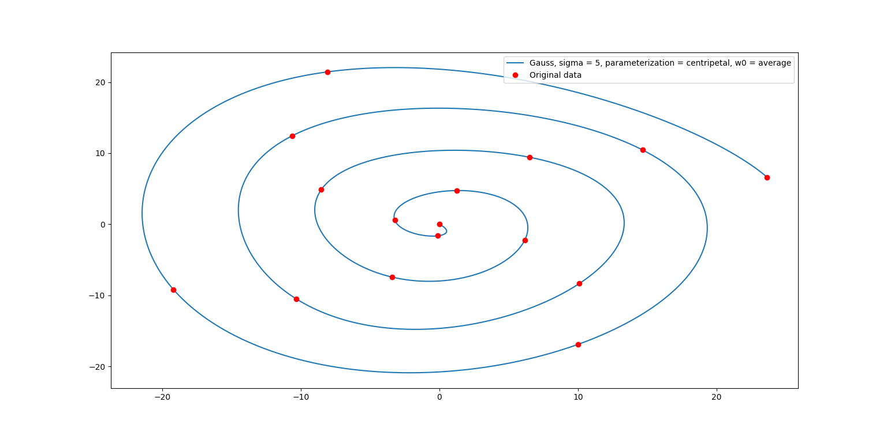
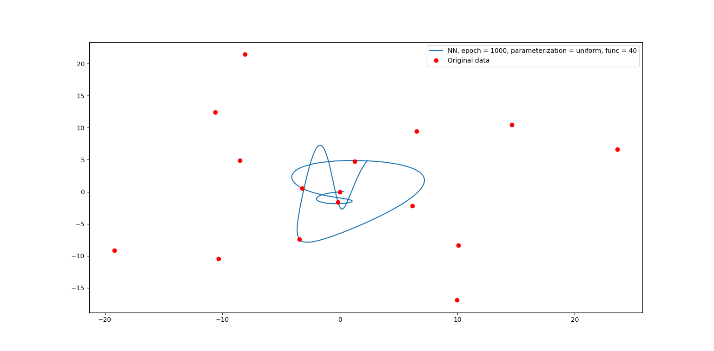
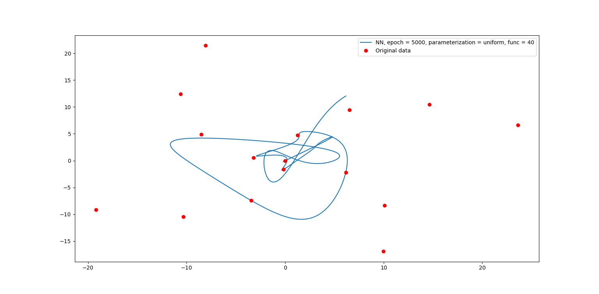
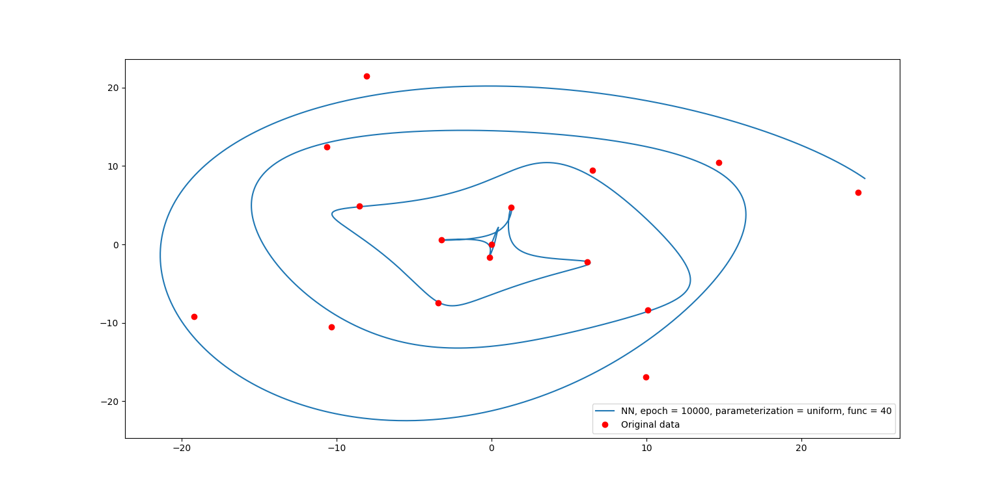
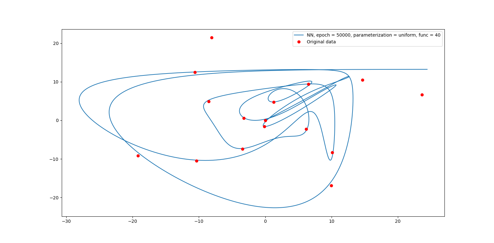
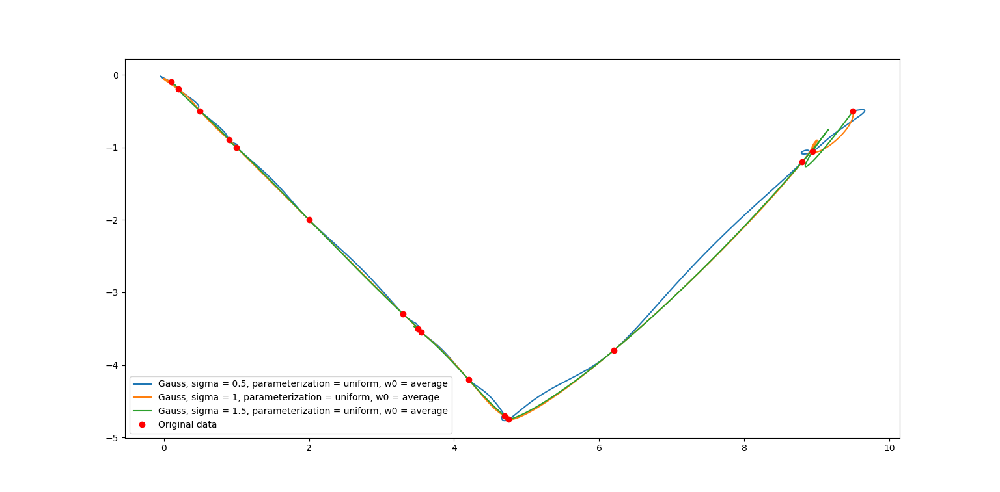
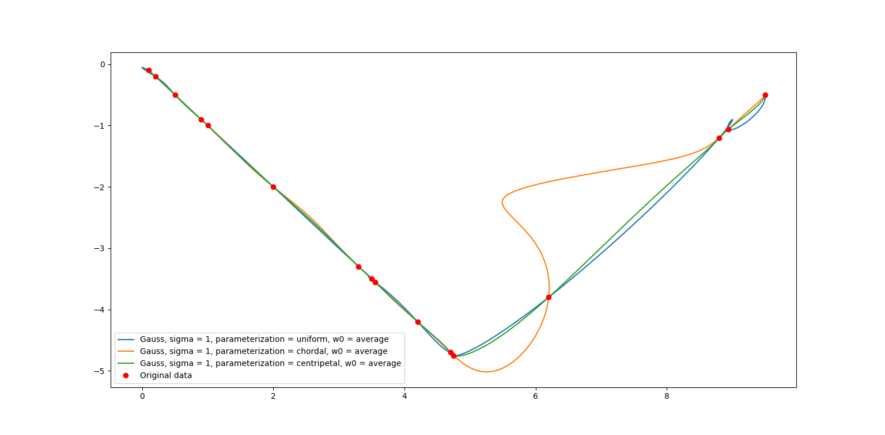
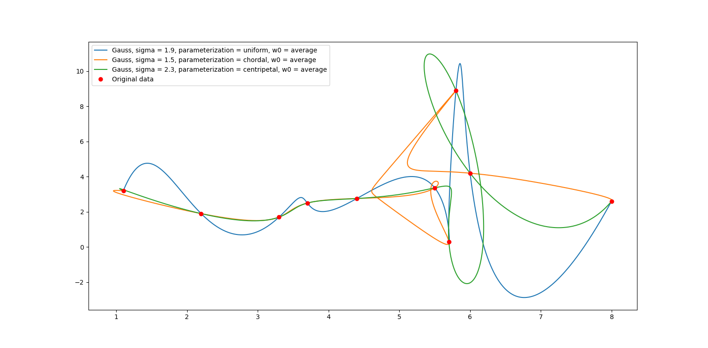

# 作业3报告

2020/10/31 余畅 电子科技大学

### 问题

使用单参数曲线来拟合平面上任意有序点列。

### 实现

本次作业基于作业1和作业2的实现，分别使用了高斯基函数插值和神经网络拟合的方法。不同之处在于先对输入的有序点列 $(x_i, y_i)$ 先预计算出参数 $t$，然后使用参数 $t$ 作为输入分别对 $x$ 和 $y$ 分量进行拟合。对神经网络来说就是对 $y$ 分量增加一组 $(v_i, w_i, b_i)$ 的神经元，对基函数插值来说就是对 $y$ 分量额外进行一次矩阵构造和求逆。基于作业2中对于超参数的讨论，本次作业中对于 $w_0$ 的选取默认取相应分量的均值。

实现的参数化方法有：

+ **Equidistant (uniform) parameterization**

```Python
def uniform_parameterization():
    for i in range(1, n_samples): t[i] = t[i - 1] + 1.0
```

+ **Chordal parameterization**

```Python
def chordal_parameterization():
    for i in range(1, n_samples): 
        t[i] = t[i - 1] + np.linalg.norm(np.asarray([train_X[i] - train_X[i - 1], train_Y[i] - train_Y[i - 1]]))
```

+ **Centripetal parameterization**

```Python
def centripetal_parameterization():
    for i in range(1, n_samples): 
        t[i] = t[i - 1] + np.sqrt(np.linalg.norm(np.asarray([train_X[i] - train_X[i - 1], train_Y[i] - train_Y[i - 1]])))
```

+ **Foley parameterization**（正确性有待商榷，故在本次作业中忽略对其的讨论）

```Python
def foley_parameterization():
    for i in range(1, n_samples):
        k1 = np.asarray([train_X[i - 1], train_Y[i - 1]])
        k2 = np.asarray([train_X[i], train_Y[i]])
        k0 = (k1 if i == 1 else np.asarray([train_X[i - 2], train_Y[i - 2]]))
        k3 = (k2 if i == n_samples - 1 else np.asarray([train_X[i + 1], train_Y[i + 1]]))
        k01 = k1 - k0
        k12 = k2 - k1
        k23 = k3 - k2
        n01 = np.linalg.norm(k01) + 1e-5 # ||ki - ki-1||
        n12 = np.linalg.norm(k12) + 1e-5 # ||ki+1 - ki||
        n23 = np.linalg.norm(k23) + 1e-5 # ||ki+2 - ki+1||
        a_i = np.arccos(k01.dot(k12) / (n01 * n12)) # ai = angle(ki-1, ki, ki+1)
        a_i1 = np.arccos(k12.dot(k23) / (n12 * n23))
        ahat_i = min(np.pi - a_i, np.pi / 2)
        ahat_i1 = min(np.pi - a_i1, np.pi / 2)
        t[i] = t[i - 1] + n12 * (1 + 3 / 2 * ahat_i * n01 / (n01 + n12) + 3 / 2 * ahat_i1 * n12 / (n12 + n23))
```


### 结果







该测试数据使用的是无噪声的螺旋线，即 $r = a \theta$，构造时对 $\theta$ 间隔均匀采样。结果中给出的 $\sigma$ 参数分别对每种特定方法调参选取最优值。可以看出对于同样是均匀选取 $t$ 参数的 `uniform_parameterization` 基本均匀还原出了原曲线的分布，而 `centripetal_parameterization` 虽然较为拟合原曲线的形状和性质，但是并没有完全还原出各处均匀的性质，存在一定的扭曲，而 `chordal_parameterization` 分别给出了 $\sigma$ 为 $7.5,10,12.5$ 的情况，总是在不同部位有过拟合和欠拟合的情况，和原曲线相差较大。









神经网络的情况和作业2相差较大，作业2使用神经网络进行函数拟合时，迭代次数较低时可以反应函数的低频性质，迭代次数增加时则可以反应出更多高频局部特征。但在本次作业中，较低次数的迭代得到的曲线更多的缩在原点周围，仅能表达原点周围几个点的特征，即对局部过拟合而全局欠拟合；而迭代次数增加引入的过拟合，相较于1维数据对拟合准确性影响更为显著，且拟合准确度对迭代次数范围非常敏感。对于本组数据，对 $x, y$ 分量分别使用 $40$ 组基函数，采用`uniform_parameterization` 参数化时，$10000$ 次的迭代次数大约能得到最好的结果，但即使如此，仍然无法消除原点附近的过拟合现象（改变基函数数量时也是如此）。为保证曲线的光滑性等，需要在损失函数中进一步引入正则项。



本组数据采用的是分段连续线性函数，并随机间隔取点。可以看到 $\sigma$ 参数的选取对曲线准确性（在本数据中表现为线性）有一定的影响，但是右端的波动无法消除。



`centripetal_parameterization` 参数化在本组数据中则可以较好的解决这个问题，曲线的两个分段都近似的为线性。



本组数据采用的是作业2中的一维函数数据，$\sigma$ 参数分别对不同的方法手动调参，`uniform_parameterization` 参数化在本组数据中表现最好，但是最好的结果也比不上仅使用一维函数拟合的结果，可见对于某种高维数据，并不是在拟合的时候引入越多的维度和参数就越好。

### 总结

参数化方法的选取是拟合结果好坏的一个重要因素，不同数据的分布，需要引入不同适合的参数化方法。相比与一维函数拟合，二维曲线拟合引入了更多的函数，使得神经网络拟合出现了更多的不稳定性，容易对各种超参数敏感，且如果不使用更优越的方法或者引入更多限制的模型的话，局部过拟合和全局欠拟合的冲突难以协调。对于更高维的数据，最好能通过预先观测数据特征或尝试auto-encoder对数据进行降维处理，以避免高维数据处理的种种不便。

g1n0st

2020/10/31

