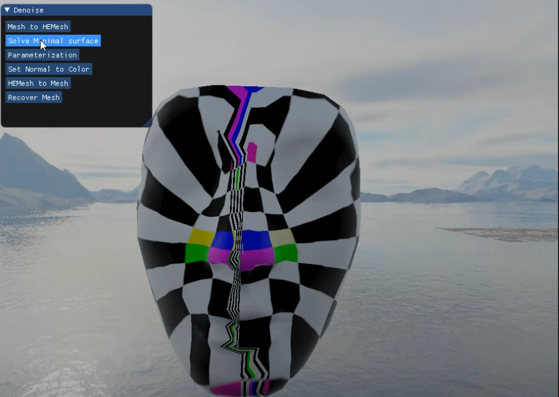
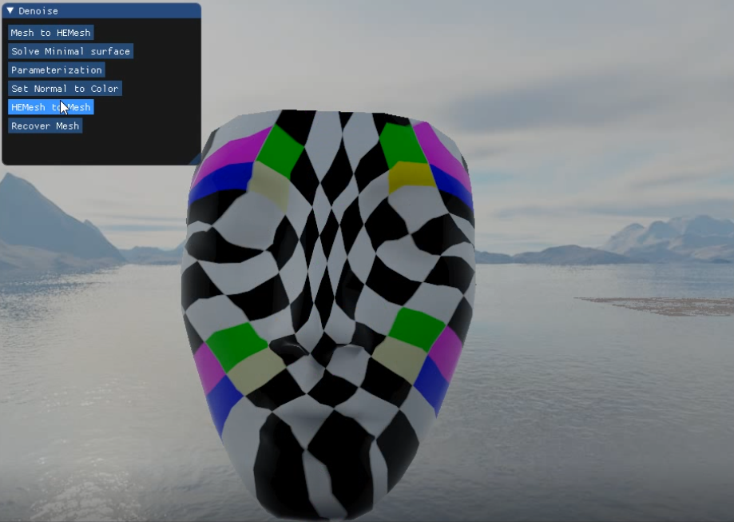
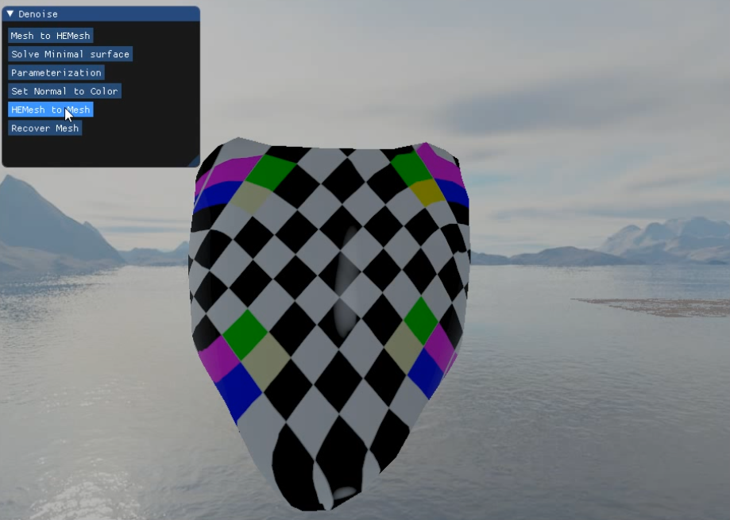

# 作业7报告

2020/12/10 余畅 电子科技大学

### 问题

+ 实现极小曲面的全局方法：边界固定，求解方程组 
+ 实现曲面参数化：边界映射到平面，求解方程组 
+ 只要实现Floater1997论文中的一种方法（cot权）即可，其他的可选

### 实现

求极小曲面和实现曲面参数化的关键在于稀疏矩阵的构建和求解，为了方便后续操作，我们首先在`Vertex` 结构体中添加所需要的属性。

```C++
struct Vertex : Ubpa::TVertex<HEMeshXTraits> {
	int idx{ -1 };
	int bidx{ -1 }; // idx on boundary, guarantee continuous on the boundary
	Ubpa::pointf3 position{ 0.f };
	Ubpa::normalf normal{ 0.f };
	Ubpa::pointf2 uv { 0.f };
};
```

其中 `idx` 保存的是该顶点的编号（和在数组中相应的下标一致），`bidx` 保存边界上的顶点的编号（在边界上连续），`uv` 保存的是参数化后重新更新的UV坐标。

#### 极小曲面

求解极小曲面并不需要求得连续的边界顶点，但是由于要构建 $(3m+3n) \cdot 3n$ 的稀疏矩阵，其中 $m$ 为固定边界点的个数，$n$ 为总顶点的个数，需要先求出 $n$，$m$，利用 Utopia 框架的内置函数，可以很容易求得：

```C++
const auto vertices = data->heMesh->Vertices();
int totalPoints = static_cast<int>(vertices.size()), boundaryPoints = { 0 }, innerPoints = { 0 };
for (int i = 0; i < totalPoints; ++i) {
	vertices[i]->idx = i;
	if (vertices[i]->IsOnBoundary()) ++boundaryPoints;
}
innerPoints = totalPoints - boundaryPoints;
```

通过调用Eigen，即可初始化相应的矩阵和向量：

```C++
Eigen::SparseMatrix<float> A(3 * (totalPoints + boundaryPoints), 3 * totalPoints);
Eigen::SparseVector<float> b(3 * (totalPoints + boundaryPoints));
```

本次作业没有采用 $\omega_{ij}=(\mathbf{cot} \alpha_{ij} + \mathbf{cot} \beta_{ij})$ 的cot权，而是用以下的权构建矩阵：

$\mathbf{A}_{i,i}=deg(i)$,  $ 0 \le i < 3n$

$\mathbf{A}_{i,j}=\mathbf{A}_{n+i,n+j}=\mathbf{A}_{2n+i,2n+j} = -1$,  $\exist 0 \le i, j < n, (i, j) \in E$

$\mathbf{A}_{3(n+\mathbf{bidx}(i))+0,i}=\mathbf{A}_{3(n+\mathbf{bidx}(i))+1,n+i}=\mathbf{A}_{3(n+\mathbf{bidx}(i))+2,2n+i}=1$，$\exist 0 \le i < n, i \in boundary$

$\mathbf{b}_{3(n+\mathbf{bidx}(i))+0}=x_i$

$\mathbf{b}_{3(n+\mathbf{bidx}(i))+1}=y_i$

$\mathbf{b}_{3(n+\mathbf{bidx}(i))+2}=z_i$

在代码中为：

```C++
int b_idx = 0;
for (auto* v : data->heMesh->Vertices()) {
	const auto P = v->position;
	// A_ij & x_i
	if (v->IsOnBoundary()) {
		for (auto k : { 0, 1, 2 }) {
			b.coeffRef(ConsIdx(b_idx, k)) = P[k];
			A.coeffRef(ConsIdx(b_idx, k), Idx(v->idx, k)) = 1;
		}
		++b_idx;
	}
	const auto& adj_v = v->AdjVertices();
	for (auto k : { 0, 1, 2 }) 
		A.coeffRef(Idx(v->idx, k), Idx(v->idx, k)) = v->AdjVertices().size();
	
		for (auto* adj : adj_v) {
		for (auto k : { 0, 1, 2 }) A.coeffRef(Idx(v->idx, k), Idx(adj->idx, k)) = -1;
	}
}
```

然后即可在最小二乘的意义下解该矩阵：

$\mathbf{A}^{T}\mathbf{A}\mathbf{x}=\mathbf{A}^{T}\mathbf{b}$

$\mathbf{x}=(\mathbf{A}^{T}\mathbf{A})^{-1}\mathbf{A}^{T}\mathbf{b}$

利用Eigen库自带的共轭梯度，即可很容易的实现高效的迭代求解稀疏矩阵：

```C++
Eigen::ConjugateGradient<Eigen::SparseMatrix<float> > solver;
solver.setTolerance(1e-4);
solver.compute(A.transpose() * A);
Eigen::SparseVector<float> x(3 * totalPoints);
x = solver.solve(A.transpose() * b);
```


#### 参数化

为了防止面片翻转和自交，参数化需要将连续边界顶点映射到一个凸多边形（一般为正方形）上，我们先取任意一个边界点，在二维流形上一个边界点只可能和另外两个边界点相连，所以我们标记 其中一边的边界点，再向另外一边迭代即可，代码如下：

```C++
const auto vertices = data->heMesh->Vertices();
int totalPoints = static_cast<int>(vertices.size()), boundaryPoints = { 0 }, innerPoints = { 0 };
for (int i = 0; i < totalPoints; ++i) vertices[i]->idx = i;
int bpt;
for (int i = 0; i < totalPoints; ++i)
	if (vertices[i]->IsOnBoundary()) bpt = vertices[i]->idx; // start point
do {
	vertices[bpt]->bidx = boundaryPoints++;
	const auto& adj_v = vertices[bpt]->AdjVertices();
	for (auto* v : data->heMesh->Vertices()) {
		if (v->IsOnBoundary() && v->bidx < 0) {
			bpt = v->idx;
			break;
		}
	}
} while (vertices[bpt]->bidx < 0);
```

有了每个边界点的 `bidx`，我们先做曲线参数化求得 `t=4bidx/m` ，那么按照以下分类讨论 mapping UV坐标即可：

$U=0, V=t$,  $t \in [0, 1]$

$U=t-1, V=1$,  $t \in (1, 2]$

$U=1, V=3-t$,  $t \in (2, 3]$

$U=4-t, V=0$,  $t \in (3, 4]$

$\mathbf{A}$ 和 $\mathbf{b}$ 的构建和求极小曲面时类似，只不过大小是 $(2m+2n) \cdot 2n$ 和 $(2m+2n)$ ，代码如下：

```C++
for (auto* v : data->heMesh->Vertices()) {
	const auto P = v->position;

	// A_ij & x_i
	if (v->IsOnBoundary()) {
		{ // project to UV surface
			float t = 4 * float(v->bidx) / float(boundaryPoints);
			float U = { 0.0f }, V = { 0.0f };
			if (t <= 1.0f) V = t;
			else if (t <= 2.0f) U = t - 1, V = 1.0f;
			else if (t <= 3.0f) U = 1.0f, V = 1.0f - (t - 2.0f);
			else U = 1.0f - (t - 3.0f);

			spdlog::info(std::to_string(U) + " " + std::to_string(V));

			b.coeffRef(ConsIdx(v->bidx, 0)) = U;
			b.coeffRef(ConsIdx(v->bidx, 1)) = V;
		}
		for (auto k : { 0, 1 }) A.coeffRef(ConsIdx(v->bidx, k), Idx(v->idx, k)) = 1;
	}
	const auto& adj_v = v->AdjVertices();
	for (auto k : { 0, 1 })
		A.coeffRef(Idx(v->idx, k), Idx(v->idx, k)) = v->AdjVertices().size();

	for (auto* adj : adj_v) {
		for (auto k : { 0, 1 }) A.coeffRef(Idx(v->idx, k), Idx(adj->idx, k)) = -1;
	}
}
```

线性方程组的求解和之前类似，故不在此赘述。


### 结果

+ 原模型及UV




+ 重新参数化

  

  

  

+ 求极小曲面+参数化

  


更多演示结果见 `Videos` 文件夹下的演示视频。

by g1n0st

2020/12/11