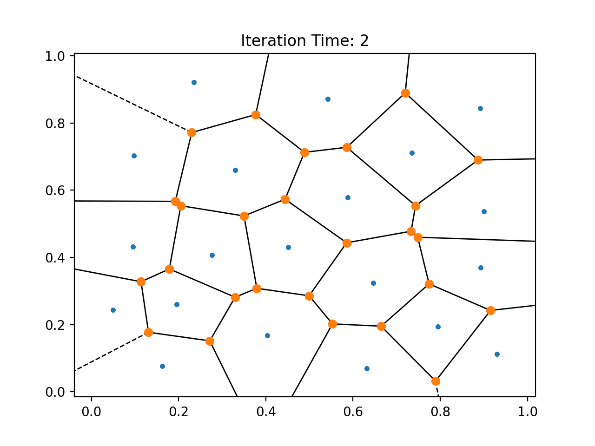

# 作业8报告

2020/12/19 余畅 电子科技大学

### 问题

+ 实现平面点集CVT的Lloyd算法

### 实现

+ 在给定的正方形区域内随机生成若干采样点
+ 生成这些点的Voronoi剖分
+ 计算每个剖分的重心，将采样点的位置更新到该重心 
+ 迭代步骤2和3

这次作业使用Python完成，求Voronoi剖分使用的是`scipy`库中的`scipy.spatial.Voronoi`来完成，并使用`scipy.spatial.voronoi_plot_2d`和`matplotlib.pyplot`实现了剖分的可视化。结果如下：

在平面上使用`numpy.random.random` 随机采样得到的点集和剖分：

迭代1次后，结果已经有了极大的改善：

迭代2次：

迭代3次：

另一组100个随机采样点的点集如下：

迭代10次后：

迭代20次后：

迭代30次后：

更多结果见 `Figure` 和 `Video` 文件夹。

by g1n0st

2020/12/19